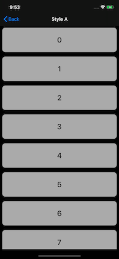
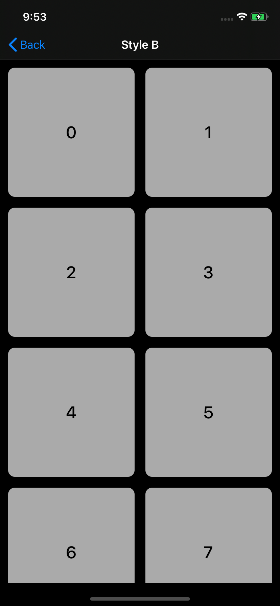
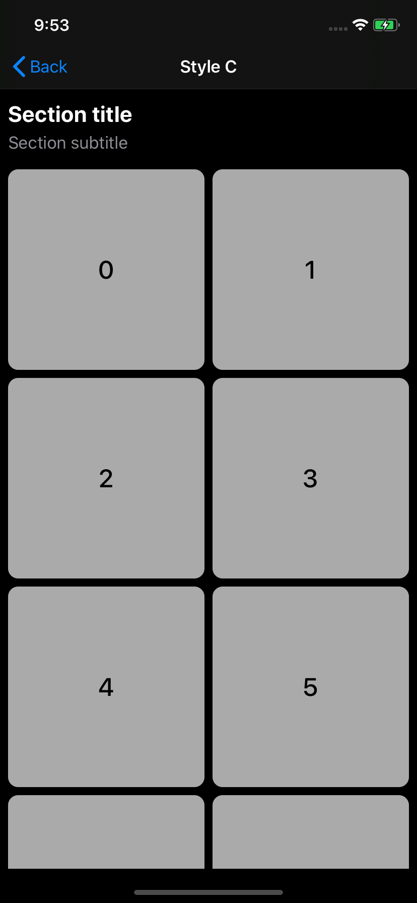
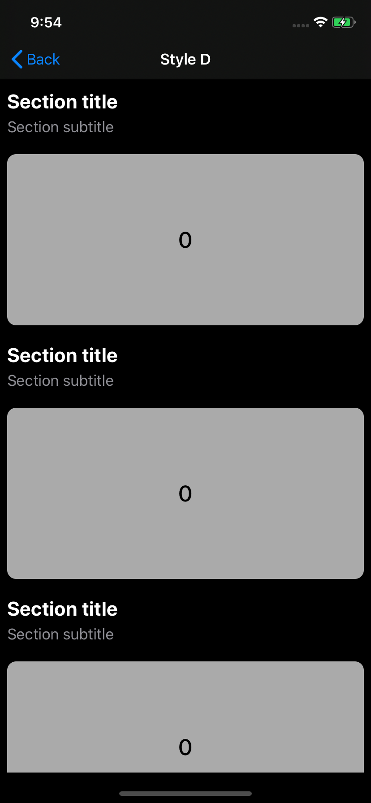
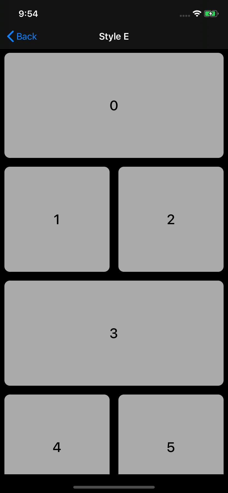
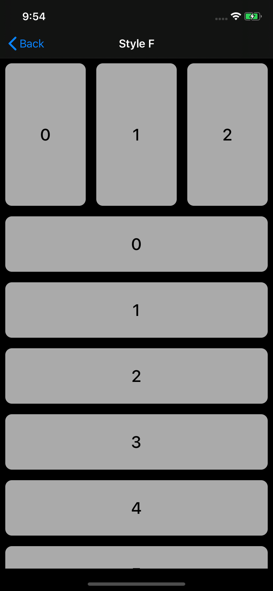

# UICollectionViewCompositionalLayoutDemo

Sample project to demonstrate how to create different layouts using UICollectionViewCompositionalLayout which was released on iOS 13.

## Contents

Each layout style can be found [here](https://github.com/DeluxeAlonso/UICollectionViewCompositionalLayoutDemo/tree/development/UICollectionViewCompositionalLayoutDemo/CompositionalLayouts).

 
 
 

## Contributing

Feel free to open an issue or submit a pull request if you have any improvement or feedback.

## Author

Alonso Alvarez, alonso.alvarez.dev@gmail.com
